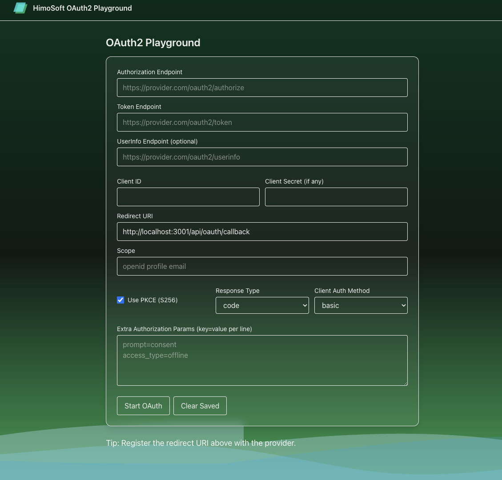

## HimoSoft OAuth2 Playground

Test and debug OAuth 2.0 / OpenID Connect providers with a modern Next.js app. Supports Authorization Code (with PKCE), token exchange, optional refresh, and userinfo fetching.



### Features

- **Authorization Code + PKCE**: Generates and manages `code_verifier` and `code_challenge` (S256)
- **Dynamic redirect URI**: Prefills based on current host (e.g., `http://localhost:3000/api/oauth/callback`)
- **Local persistence**: Saves form inputs in localStorage for quick retesting
- **Token exchange**: Handles `authorization_code` grant and stores tokens server-side in cookies
- **Token refresh**: Refresh route and UI if your provider issues `refresh_token`
- **UserInfo viewer**: Fetches user profile with `Authorization: <token_type> <access_token>`; fallback to query param if needed
- **Re-authorize**: One-click re-auth flow for providers without refresh tokens
- **Clear session**: Button to clear both localStorage and server cookies
- **Docker-ready**: Multi-stage, standalone Next.js build

### Tech stack

- **Next.js 15 (App Router)**, TypeScript, Tailwind CSS 4
- Minimal dependencies; no auth libraries required

## Getting started

### Prerequisites

- Node.js 20+
- npm 10+

### Install and run

```bash
npm install
npm run dev
# Local: http://localhost:3000 (or 3001 if 3000 is busy)
```

### Build and start (production)

```bash
npm run build
npm start
```

## Docker

Build and run the container:

```bash
docker build -t oauth2-playground:latest .
docker run --rm -p 3000:3000 oauth2-playground:latest
# Local: http://localhost:3000
```

For Linux/amd64 images (CI/CD or certain registries):

```bash
docker buildx build --platform linux/amd64 -t your-repo/oauth2-playground:latest .
```

## How to use

1. Open the app and fill the form:
   - **Authorization Endpoint** (e.g., `https://provider.com/oauth2/authorize`)
   - **Token Endpoint** (e.g., `https://provider.com/oauth2/token`)
   - Optional: **UserInfo Endpoint** (e.g., `https://provider.com/oauth2/userinfo`)
   - **Client ID**, optional **Client Secret**
   - **Redirect URI** (auto-filled)
   - **Scope** (e.g., `openid profile email`)
   - **Response Type** = `code` (recommended)
   - **Client Auth Method** = `basic` or `body` (match provider)
   - Extra authorization params (one per line), e.g.:
     - `prompt=consent`
     - `access_type=offline`
2. Click “Start OAuth” to begin the flow.
3. On callback, the app exchanges the code for tokens and redirects to `/oauth/result`.
4. In the result page you can:
   - Inspect tokens and config
   - Click “Get UserInfo” (uses Authorization header; falls back to `access_token` query for some providers)
   - If your provider returned `refresh_token`, use “Refresh Token”
   - If your provider does not issue refresh tokens, use “Re-authorize” to quickly restart the flow with saved config
   - “Back to Home” / “Start Over” to return
   - “Clear Saved” (on home) wipes localStorage and server cookies to fully reset

### Notes for common providers

- **Google**: add extra params `access_type=offline` and `prompt=consent` if you want a `refresh_token`
- **Microsoft Entra ID (Azure AD)**: include `offline_access` in scope for refresh tokens
- **Auth0 / Okta**: include `offline_access` scope for refresh tokens

If you only need short-lived access tokens, you can skip refresh and use “Re-authorize” when tokens expire.

## Endpoints (internal)

- `POST /api/oauth/start`: starts auth, sets cookies (`oauth_state`, `oauth_code_verifier`, `oauth_config`), redirects to authorization endpoint
- `GET /api/oauth/callback`: validates state, exchanges code, stores tokens in `oauth_tokens`, redirects to `/oauth/result`
- `POST /api/oauth/refresh`: refreshes tokens when `refresh_token` is available
- `GET /api/oauth/userinfo`: fetches user info with the current `access_token` (auto-refresh on 401/403 when possible; falls back to `access_token` query param)
- `POST /api/oauth/clear`: clears all OAuth cookies to reset session state

## Configuration and storage

- Sensitive tokens are stored in httpOnly cookies on the server, not in localStorage
- Form inputs are saved in the browser’s localStorage (for convenience only)

## Security considerations

- Use HTTPS in production
- Register the exact redirect URI with your provider (the app pre-fills it based on your host)
- Prefer Authorization Code + PKCE for public clients
- Avoid using `response_type=token` unless absolutely necessary

## Branding

- Header and footer branded for HimoSoft; favicon/shortcut icon uses `public/logo.png`
- Footer includes version (from `package.json`) and bug contact: `bug@himelrana.com`

## License / Contact

- © HimoSoft. All rights reserved. Visit [himosoft.com.bd](https://himosoft.com.bd)
- Report issues: `bug@himelrana.com`

This is a [Next.js](https://nextjs.org) project bootstrapped with [`create-next-app`](https://nextjs.org/docs/app/api-reference/cli/create-next-app).

## Getting Started

First, run the development server:

```bash
npm run dev
# or
yarn dev
# or
pnpm dev
# or
bun dev
```

Open [http://localhost:3000](http://localhost:3000) with your browser to see the result.

You can start editing the page by modifying `app/page.tsx`. The page auto-updates as you edit the file.

This project uses [`next/font`](https://nextjs.org/docs/app/building-your-application/optimizing/fonts) to automatically optimize and load [Geist](https://vercel.com/font), a new font family for Vercel.

## Learn More

To learn more about Next.js, take a look at the following resources:

- [Next.js Documentation](https://nextjs.org/docs) - learn about Next.js features and API.
- [Learn Next.js](https://nextjs.org/learn) - an interactive Next.js tutorial.

You can check out [the Next.js GitHub repository](https://github.com/vercel/next.js) - your feedback and contributions are welcome!

## Deploy on Vercel

The easiest way to deploy your Next.js app is to use the [Vercel Platform](https://vercel.com/new?utm_medium=default-template&filter=next.js&utm_source=create-next-app&utm_campaign=create-next-app-readme) from the creators of Next.js.

Check out our [Next.js deployment documentation](https://nextjs.org/docs/app/building-your-application/deploying) for more details.
